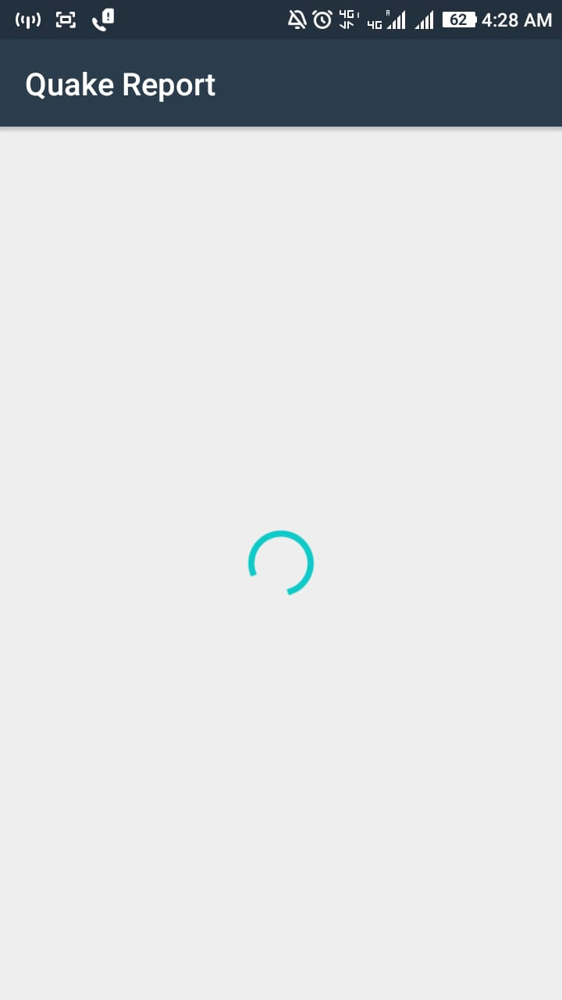
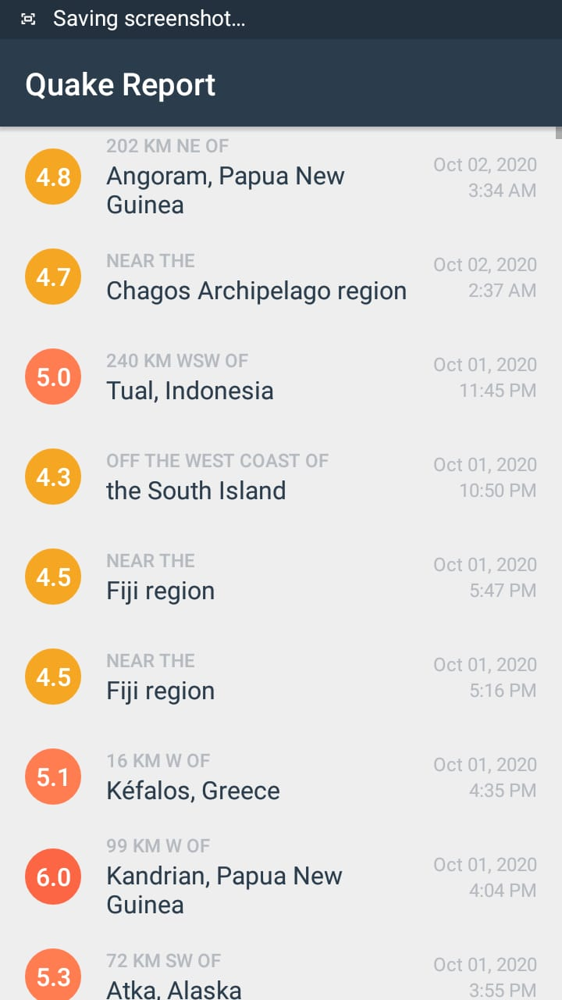
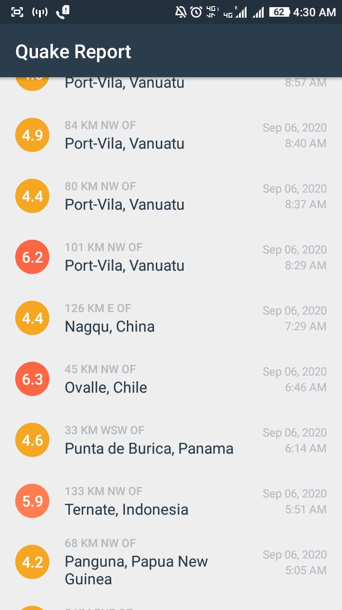
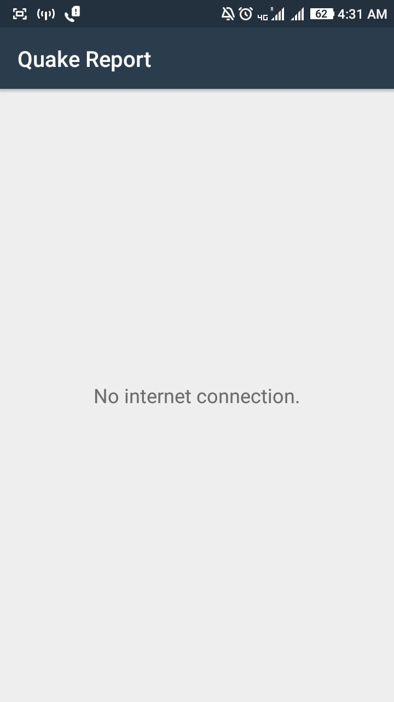

# EarthquakeReport
This app helps to find information about Earthquakes happening around the world.
I have used USGS's API to gather data in the form of JSON file. Then i parsed the JSON file to get the necessary information and use it according to my UI. You can click on each entry
of earthquake and you will be directed to the USGS website. I have taken care of things like bad connectivity and no internet connection.

Here are some screenshots of the app

   

